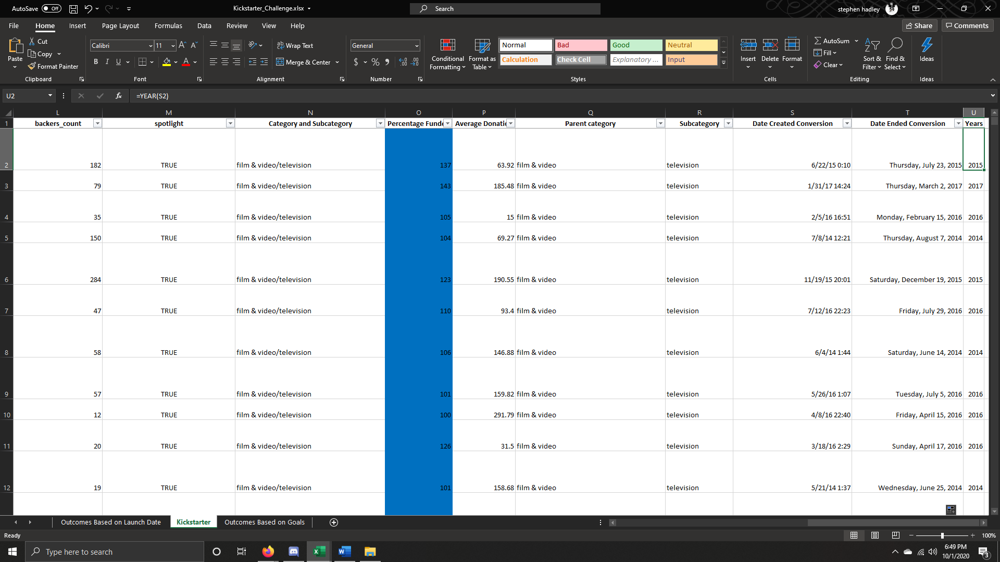
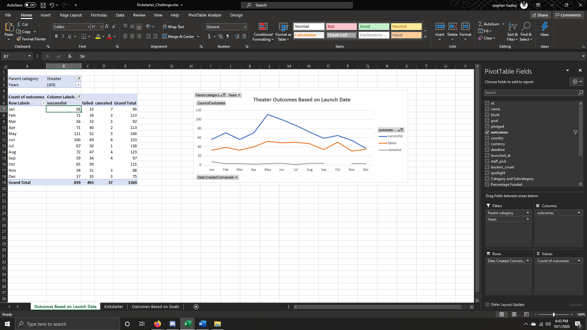
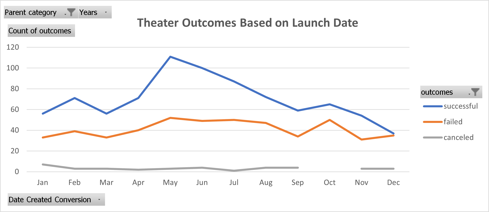
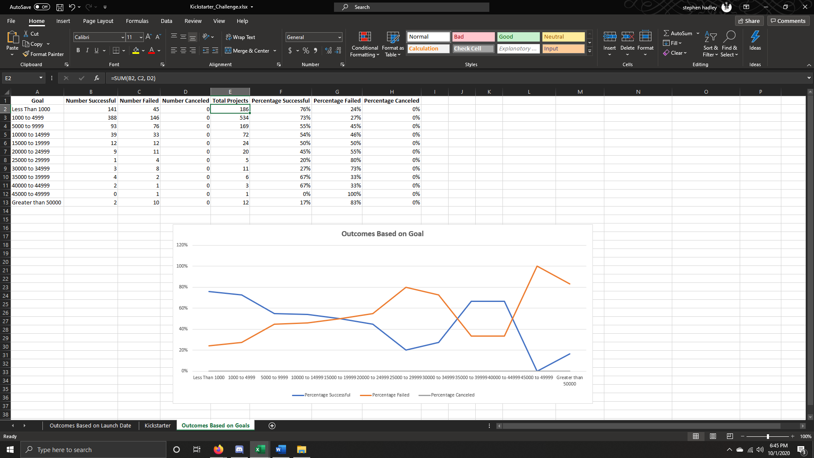
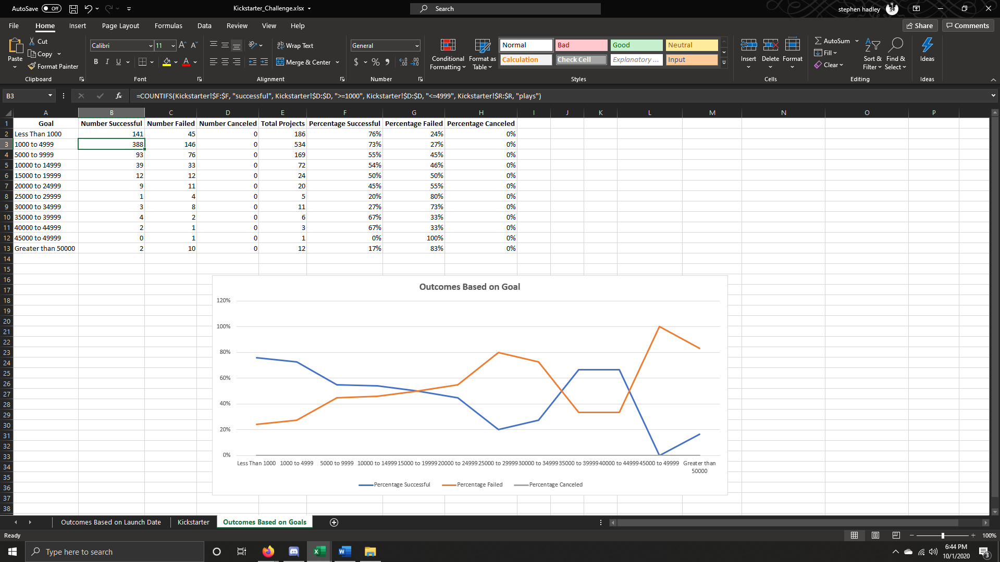
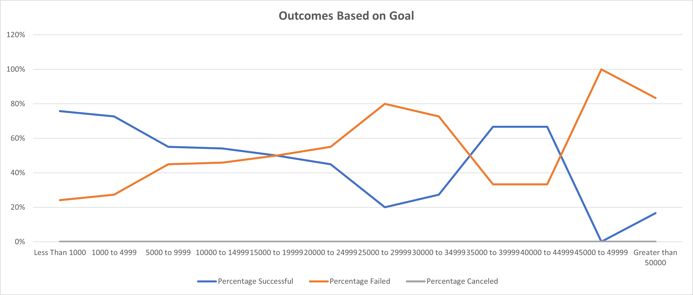

# Kickstarter_Analysis_Challenge
Looking at kickstarter campaigns data and looking for trends in the data.
---
# Kickstarting with Excel

## Create a years column, make a pivot table showing parent categories and years as a filter and count the number of successes, failures, canceled, and live kickstarters there were in that dataset. Next create a new sheet that gathers info about the outcomes based on the goals that were set and how the goal affected the kickstarter.
---
## Purpose
### In this project we were tasked with using the same dataset as before from louise and started by making a new column for years, this would be used to deteremine the year the kickstarter started in. Next we looked to find how the theater category affected the success of a kickstarter dependent on the launch date, now to look for a trend in the plays subcategory and see how dependent the funding goals were for a high success percentage or a failed, canceled , or live percentage, this would be used to deteremine if the goal set is considered an outlier on our chart or within the success margin.
---
## The information that is gathered in this excel sheet can help people planning to make a kickstarter campaign, even if the person does not know the program the graphs alone provide a very large amount of information that can change the outcome of any kickstarter and be the deciding factor in success or failure. There is a challenge with this however in the regard that this is very specfic data and even though there is a high success rate during certain times of the year there is also a considerable amount of failures therefore the challenge is to correctly identify when and how much of a goal should be set.
---
## Theater Outcomes Based on Launch Dates
### The information in the pivot chart for how the theater outcomes are deteremined using the information gathered from the year column, this way we can look at each year and see how each kickstarter did in certain months, this can help choose the ideal time frame to run a theater campaign. The only problems I can see in this area is messing up on the years column and forgetting to add the +DATE(1970, 1, 1), I personal had a little trouble setting up the table the right way at first and learned that right clicking the years in the pivot table itself allowed me to group the year into a different format, one that only shows months in the first column.

---

---

---
## Oucomes Based on Goals
### As for the outcomes based on goals I started by making a new sheet and entering the information given then worked through the formulas and got a dataset from the ranges I put in place this was helpful to deteremine the chances of a successful kickstarter based on the goal that is set and can help to prevent wasting time. I had a bit of trouble with getting the graph to show similar data and learned that the filters that are applied on the kickstarter sheet do not apply to the COUNTIFS function so I must put that in the range to prevent all the data from coming through, I had the problem with the subcategory of plays and thought that since I filtered it in the kickstarter sheet it should also filter in the function.

---

---

---
### The summertime is the best time to launch a kickstarter campaign by a long shot if you do not then you are losing massive support. The failures stay pretty consistent year round if we had one more data variable there could be reasoning behind that. I also suspect that the reason the summer time is the best is a lack of school tax returns come in and people generally have more interest in doing new things.
---
### If you want to be safe about having a successful kickstarter it is safe to go around 5000 and below any higher than that and there is a much higher risk of failure.
---
### There could be a lot more information and maybe by making a pivot table for the outcomes based on goals sheet that would sort through all subcategories to allow for a more in depth search instead of just plays.
---
### I think a table or graph combining the data gathered from these two that we made in the challenge would give a perfect one stop shop to find all information involving making a kickstarter especially with the percentage success and failures and so on if we could test the same info on the months the kickstarter launched that could make a very successful kickstarter.
